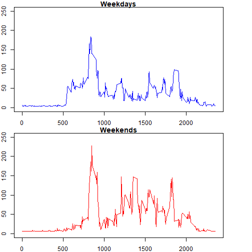

Analyzing activity monitoring dataset
=====================================


**First step** loading the data

```r
originaldata <- read.csv("activity.csv")
```

**Second step** getting familiar with the data, removing NAs

```r
head(originaldata)
```

```
##   steps       date interval
## 1    NA 2012-10-01        0
## 2    NA 2012-10-01        5
## 3    NA 2012-10-01       10
## 4    NA 2012-10-01       15
## 5    NA 2012-10-01       20
## 6    NA 2012-10-01       25
```

```r
tail(originaldata)
```

```
##       steps       date interval
## 17563    NA 2012-11-30     2330
## 17564    NA 2012-11-30     2335
## 17565    NA 2012-11-30     2340
## 17566    NA 2012-11-30     2345
## 17567    NA 2012-11-30     2350
## 17568    NA 2012-11-30     2355
```

```r
names(originaldata)
```

```
## [1] "steps"    "date"     "interval"
```

```r
summary(originaldata)
```

```
##      steps                date          interval     
##  Min.   :  0.00   2012-10-01:  288   Min.   :   0.0  
##  1st Qu.:  0.00   2012-10-02:  288   1st Qu.: 588.8  
##  Median :  0.00   2012-10-03:  288   Median :1177.5  
##  Mean   : 37.38   2012-10-04:  288   Mean   :1177.5  
##  3rd Qu.: 12.00   2012-10-05:  288   3rd Qu.:1766.2  
##  Max.   :806.00   2012-10-06:  288   Max.   :2355.0  
##  NA's   :2304     (Other)   :15840
```

```r
data <- originaldata[complete.cases(originaldata),]
```

**Third step** What is the mean total number of steps taken per day?

**1.** Calculating the total number of steps taken per day

```r
stpdy <- tapply(data$steps, data$date, sum)
stpdf <- data.frame(date = as.Date(names(stpdy), format = "%Y-%m-%d"),
                    steps = stpdy)
```
**2.** Plotting a histogram of total steps *per day*

```r
hist(stpdf$steps, 
     col = "green",
     xlab = "steps/day",
     main = "Total Steps Per Day")
```


**3.** Calculating the mean and median of the total number of steps taken per day

**Mean**

```r
stpdf <- stpdf[complete.cases(stpdf),]
mean(stpdf$steps)
```

```
## [1] 10766.19
```
**Median**

```r
median(stpdf$steps)
```

```
## [1] 10765
```


**Fourth step** What is the average daily activity pattern?
**1.** plotting daily average steps per each interval

```r
stpint <- tapply(data$steps, data$interval, mean)
stpintdf <- data.frame(intervals = names(stpint), steps = stpint)
plot(x = as.numeric(levels(stpintdf$intervals)[stpintdf$intervals]),
     y = stpintdf$steps,
     xlab = "intervals (5-minutes)",
     ylab = "steps",
     main = "Steps per interval on average",
     type = "l",
     col = "blue")
```


**2.** calculating the interval that contains the most steps on average

```r
maxintid <- grep(max(stpintdf$steps), stpintdf$steps)
maxint <- stpintdf$intervals[maxintid]
maxint <- as.numeric(levels(maxint)[maxint])
maxint
```

```
## [1] 835
```
which is kinda what you expect from the plot


**Fifth step** Imputing missing values
**1.** calculating the total number of missing values in the dataset

```r
nrow(data[!complete.cases(data),])
```

```
## [1] 0
```

```r
length(data$steps[!complete.cases(data$steps)])
```

```
## [1] 0
```
we see also that all the NAs are contained in the steps column

**2.** filling in all of the missing values in the dataset with mean value for the entire steps column

```r
fullcolumn <- originaldata$steps[complete.cases(originaldata$steps)]
m <- mean(fullcolumn)

copydata <- originaldata

for (i in 1:length(copydata$steps)){
    if(is.na(copydata$steps[i])){copydata$steps[i] <- m}}

nrow(copydata[!complete.cases(copydata),])
```

```
## [1] 0
```

```r
length(copydata$steps[!complete.cases(copydata$steps)])
```

```
## [1] 0
```

**3.** plotting a histogram of the total number of steps taken each day using the copied data 

```r
cstpdy <- tapply(copydata$steps, copydata$date, sum)
cstpdf <- data.frame(steps = cstpdy, intervals = as.Date(names(cstpdy), format = "%Y-%m-%d"))
with(cstpdf, hist(steps, col = "blue", xlab = "steps/day", main = "Total Steps Per Day"))
```


**4.** calculating the mean and median total number of steps taken per day

**Mean**

```r
mean(cstpdf$steps)
```

```
## [1] 10766.19
```

**Median**

```r
median(cstpdf$steps)
```

```
## [1] 10766.19
```
we see that the mean has not changed but the median did

**Sixth step** Are there differences in activity patterns between weekdays and weekends?
**1.** Creating a new factor variable in the dataset with two levels – “weekday” and “weekend” indicating whether a given date is a weekday or weekend day.
*I used Fridays and Saturdays as weekends as in my country*


```r
weekends <- c("Friday", "Saturday")
copydata$weekday <- sapply(as.Date(copydata$date, format = "%Y-%m-%d"), weekdays)
for (i in 1:length(copydata$weekday)){
    if (copydata$weekday[i] %in% weekends){copydata$weekday[i] <- "weekend"}
    else {copydata$weekday[i] <- "weekday"}
}
head(copydata)
```

```
##     steps       date interval weekday
## 1 37.3826 2012-10-01        0 weekday
## 2 37.3826 2012-10-01        5 weekday
## 3 37.3826 2012-10-01       10 weekday
## 4 37.3826 2012-10-01       15 weekday
## 5 37.3826 2012-10-01       20 weekday
## 6 37.3826 2012-10-01       25 weekday
```
**2.** plotting containing a time series plot of the 5-minute interval (x-axis) and the average number of steps taken, averaged across all weekday days or weekend days (y-axis).

```r
weekdaydfs <- split(copydata, copydata$weekday)

wkdf1 <- weekdaydfs[[1]]
wkdf2 <- weekdaydfs[[2]]

wkint1 <- tapply(wkdf1$steps, wkdf1$interval, mean)
wkintdf1 <- data.frame(intervals = names(wkint1), steps = wkint1)

wkint2 <- tapply(wkdf2$steps, wkdf2$interval, mean)
wkintdf2 <- data.frame(intervals = names(wkint1), steps = wkint2)

par(mfrow = c(2,1), mar = c(2,2,1,4))
with(wkintdf1, plot(as.numeric(levels(intervals)[intervals]), 
                    steps, 
                    col = "blue", 
                    main = "Weekdays", 
                    type = "l",
                    ylim = c(0,250)))
with(wkintdf2, plot(as.numeric(levels(intervals)[intervals]), 
                    steps, 
                    col = "red", 
                    main = "Weekends", 
                    type = "l",
                    ylim = c(0,250)))
```


